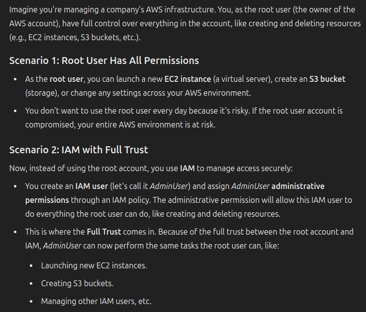
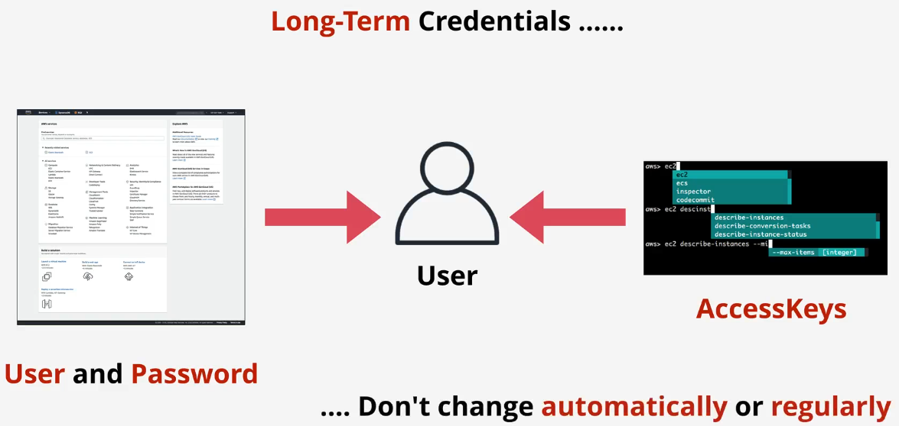

# aws account

## Trick

All unique emails, no pre-setup required

For example

- <catguy@gmail.com>
  - <cayguy+AWSAccount1@gmail.com>
  - <cayguy+AWSAccount2@gmail.com>
  - <cayguy+AWSAccount3@gmail.com>

## MFA

We only usernames and passwords - if leaked, anyone can be you!

Factors - different pieces of evidence which prove identity

- Knowledge - Something you know, usernames, passwords
- Possession - Something you have, bank card, MFA device/app
- Inherent - Something you are, fingerprint, face, voice, or iris
- Location - A location (physical), which network (corp or wifi)

More factors means more security and harder to fake

- But we should balance between convenience and security

## Secure an AWS Account

## Set up the Production AWS Account

New email for the PRODUCTION AWS Account

Remember the Gmail "+" trick

Create the PRODUCTION AWS Account

Same as the GENERAL account but - PRODUCTION

Add MFA to Account Root User (and test)

Add a BUDGET to PRODUCTION Account (remember the checkboxes)

Enable IAM User and Role Access to billing

Add account contacts

## Identity and Access Management (IAM) Basics

### IAM Basics

More control over access to resources

Account root user has full control over all of the AWS account and any resources created within in. The root user can’t be restricted

IAM User Groups and Roles can also be created and given full or limited permissions. All identities start with no permissions

Full Trust Between AWS Account and IAM:

- AWS account (especially the root user) inherently trusts the IAM service
- IAM has the same level of permissions and authorization as the root user in the account
- This means IAM users, roles, and groups created within the account can be given permissions to manage resources with the same authority as the root account (depending on what permissions you assign them)

Example:

Main jobs of IAM

- Manage identities - An ID Provider (IDP): Create, modify, and delete IDs such as users and roles

Points

- No cost
- Global service / Global resilience
- ALLOW or DENY its identities on its AWS account
- No direct control on external accounts or users
- Identity federation and MFA
  - Use Facebook, Twitter, Google, etc. to access AWS resources

### IAM Access Keys

An IAM user has 1 username and 1 password

An IAM User can have two access keys

Access keys can be created, deleted, made inactive, or made active

Access Keys consists of two parts

- Example
  - Access Key ID: ABABABABABABABA
  - Secret Access Key: oierWRhoefWORIOF/DFLWAnljef
- Both are provided when created an access key
- These are only provided once - no ability to get access to the keys again. Need to be stored safely
- Both parts are used when accessing AWS via CLI
- Access keys need to be deleted and recreated if they are leaked
- Possible to have two sets of keys such that you can create a new one, update all applications using the keys and then delete the old set
