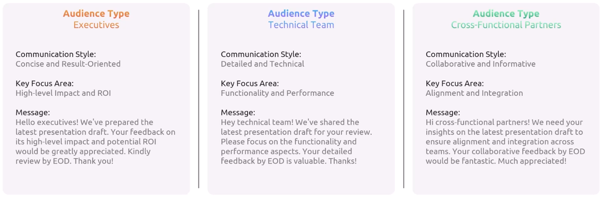

# communication expression storytelling

> The core of all successful DevOps implementations is the recognition that bad communication leads to friction - Grant Fritchey

## Verbal Skills

Ask yourself about 7 C's of effective verbal communication: clear, concise, correct, coherent, complete, concrete, courteous

Clear

- Should not use an acronym that wasn't known to your audience (also known as, refer, etc.)
- Should not use complicated, escalated, elevated words
- Keep something as simple and straightforward as possible
- Speak clearly, use precise words, and maintain a simple structure to ensure understanding
- Communicate clearly: Use precise language, proper enunciation (pronunciation), and straightforward structure for easy comprehension

Concise

- Express your thoughts and ideas in as few words as necessary
- Complex ideas are made of simple ideas. If we can just convey the simple ideas, we can actually build the complex idea
- Be brief yet clear: Convey ideas directly without excess words
- Say more with less: Deliver concise messages for better understanding

Correct

- Choose precise words, grammar, and context
- Use accurate language and grammar

Coherent

- Be structured in how you build information
- Make sure information is relational or contextual
- Start &rarr; Identify Topic &rarr; Organize Main Points &rarr; Develop Supporting Details &rarr; Ensure Logical Flow &rarr; Review and Edit
  - Identify Topic: Effective Study Habits
  - Main Points:
    - MP 1: Time Management
    - MP 2: Active Engagement
    - MP 3: Effective Note-Taking
    - MP 4: Setting Goals
  - Develop Supporting Details
    - MP 1: Create a schedule, prioritize tasks
    - MP 2: Stay focused, ask questions, participate actively
    - MP 3: Summarize key points, use keywords
    - MP 4: Establish short-term and long-term goals, track progress
  - Ensure Logical Flow:
    - Arrange main points in a logical sequence
    - Use transitions to connect ideas smoothly
  - Review and Edit
    - Check for coherence, clarity, and consistency
    - Edit for grammar, punctuation, and spelling

Complete

- Who When Where What How Why
- Does the receiver have enough information to take action or understand the concept?
- Address all relevant points comprehensively
- Anticipate and answer potential questions preemptively

Concrete

- Concrete communication refers to the use of specific, definite, and vivid language rather than abstract, vague, or general terms
- It's about providing clear details and examples that can help the listener visualize and understand your message accurately

Courteous

- Treat people with respect and dignity
- Maintain a respectful tone and polite language
- Show appreciation for the listener's time and input

> **Convey clear, correct, and concrete concepts in a concise, coherent, and courteous manner for complete comprehension**

## Written Skills

The 7C's also apply to written communication

If you can ask yourself 7 C's questions about your written communication, you're probably communicating extremely effectively

Tailor the message to the mode or medium: Different communication mediums in DevOps require distinct styles and approaches

- Slack message vs design document

Adjust the message to the audience: Effective communication depends on both the message and the audience

Read the response before you response: Take the time to fully understand messages before responding is crucial

Proofing: Grammar and spelling checks are common practices for all professional writing

- Grammarly or Microsoft Word Spell Check

Visual aids and formatting for readability: Visual aids in simple emails aid understanding, even with basic concepts, while formatting enhances readability

- Email
  - Subject line is clear and specific, providing relevant information
  - Greeting is polite and professional, creating a positive tone
  - Message includes additional context and details, improving clarity
  - Closing is courteous and appreciative, fostering goodwill and cooperation

## Nonverbal Skills

Non-verbal communication can often convey emotions and attitudes more accurately than words, making it essential for understanding team dynamics and managing interpersonal relationships

Body language: Body language speaks volumes and is often louder than words

- Posture
- Gestures
- Mirroring

Voice tone: The tone of voice in communication can change the entire message. It's not just what you say, but how you say it

- Soothing
  - Speak slowly and calmly, with a slightly lower voice and warmth
  - Be empathetic, offering comfort, especially during stressful times
  - Use when the team faces challenges or stress, like during system outages or production issues
- Openness
  - Use an open, enthusiastic, engaging tone with slight pitch elevation
  - Encourage collaboration, showing genuine interest in others’ ideas
  - Ideal for feedback, brainstorming, or fostering open discussion
- Boundary
  - Speak with firmness and clarity, using pauses for emphasis
  - Be clear and assertive, setting limits and expectations
  - Use when enforcing guidelines, deadlines, or managing resources
- Direct
  - Speak with clarity and purpose, at a steady pace
  - Focus on clear, concise communication to avoid confusion
  - Best for time-sensitive situations or when immediate action is needed

Micro-expressions: Our faces often tell a story before we even speak, especially in the collaborative and often high-stress environment of DevOps

- Brief and quick
- Involuntary
- Honest and true emotion

Eye contact: A simple yet powerful aspect of non-verbal communication, plays a crucial role in establishing connections and trust in DevOps environments

- 50% of the time when speaking
- 70% of the time when listening

Personal space management: Though often overlooked, is a critical component of non-verbal communication, particularly in diverse and collaborative environments like DevOps

- Gender
- Personal preference
- Culture

## Professionalism

In the context of DevOps, it refers to the emphasis of a "detached yet engaged" conduct, behavior, and attitude of an individual in a work environment

In the realm of DevOps, where communication threads the needle of success, professionalism is the fabric that holds it all together

Defining behaviors in DevOps: Professional behaviors in DevOps encompass a range of actions and attitudes that collectively define how we conduct ourselves in a professional setting. Effective workplace behaviors are crucial for fostering a positive and productive environment

- Explicitly defined behaviors: Communication protocol, meeting deadlines, maintaining confidentiality
- Implicitly defined behaviors: Showing initiative, being adaptable to change, demonstrating a positive attitude under pressure

Balancing personality with impartiality: In DevOps, the art of communication often lies in striking the right balance between being personally engaged and maintaining professional detachment

- Engaged yet impersonal
- Focused, neutral to upbeat demeanor
- You're not getting into a deep story or engagement about some's personal life
- Staying connected to your work and colleagues while maintaining impartiality and not letting personal issues interfere with work
- As a DevOps engineer, one should focus on DevOps-related tasks rather than getting distracted by irrelevant personal matters

How and when to apply it: Everyday communications in DevOps, from emails to team chats, are opportunities to demonstrate professionalism

- The 7 C’s help - clear, respectful
- Timeliness and responsiveness
- Constructive and progressive
- Consistency in reaction and action

Strategies to navigate challenges

- Problems: Conflict, stress, misunderstanding
- Solutions: Mindfulness and meditation practices, active listening and cueing, expressing empathy, seeking feedback

## Story

Context: Forrester provides background on an earlier presentation he gave about the value of AWS certifications to his team. In his initial presentation, he used a slide deck filled with generic data about cloud adoption and AWS, which was popular for operational offloading. However, the audience seemed disengaged, and Forrester noticed that his information was out of context, uninspiring, bland, and not framed in a way that connected with the audience emotionally or intellectually

Solutions

- Recognizing the problem: After noticing that the audience was disengaged, Forrester realized his mistake. He had focused on presenting raw facts and data without considering the emotional and contextual elements of storytelling. He acknowledged the importance of engaging the audience on a deeper level rather than just delivering dry information
- Changing approach: For his next presentation to a similar group, he decided to take a different approach by framing the information in a relevant contextual story. Instead of just listing statistics, he painted a picture of the rapidly evolving tech landscape and the challenges teams face, such as dealing with end-of-life infrastructure and tech sprawl
- Incorporating storytelling: He used a real-world story of a team that had transformed their operations by migrating to AWS. This allowed him to weave technical information into a narrative that was more relatable and engaging. He also highlighted the benefits of AWS certifications not only for the company but also for personal career growth
- Framing the message as a story: He structured the information around a problem to be solved, transformation, and resolution. This approach made the information more relatable by introducing characters (e.g., "Sarah," a team member), a conflict, and a resolution. He framed the skills learned from the AWS certification not just as business benefits but also as personal career opportunities
- Practical advice: He introduced the importance of soft skills for career growth, mentioning how DevOps soft skills can help professionals manage teams, inspire others, and communicate effectively in leadership roles

Technique

- Find the human connection: Think about the audience and what kind of problems they have or talk about someone's experience
- Create a narrative arc: Start with the problem, clarity, resolution

Result: The result of this new approach was positive. By framing the presentation as a story, Forrester was able to engage the audience on a deeper, emotional level. The story made the information more memorable and relatable, and the audience could see themselves in the narrative. Forrester was able to effectively communicate the value of AWS certifications, not only in terms of operational benefits for the business but also as a means for personal career development. This approach led to better engagement and a more compelling presentation that resonated with the audience
